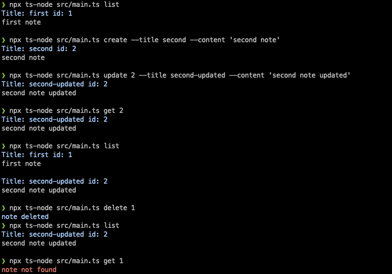

# Note Manager CLI
A simple CLI for managing notes & persisting them in a JSON file.
The notes are saved in a file called 'notes.json' in the project's root directory.
## Perquisites
* nodejs version 18 or higher
* yarn

## Installation
```bash
cd <project directory>
yarn install
```

## Usage
```bash 
npx ts-node <command> [options]
```
### List notes
Fetch a paginated list of notes 
```bash
npx ts-node list --skip <int> --limit <int>
```
### Fetch note
Fetch a single note using its ID
```bash
npx ts-node get <int>
```
### Create a note
create a new note
```bash
npx ts-node create --title <str> --content <str>
```
### Delete note
delete a note using its ID
```bash
npx ts-node list delete <int>
```
### Update a note
update the title and content of a note using its ID
```bash
npx ts-node update <int> --skip 0 --limit 10
```

## Screenshot
